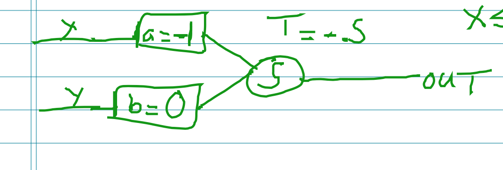
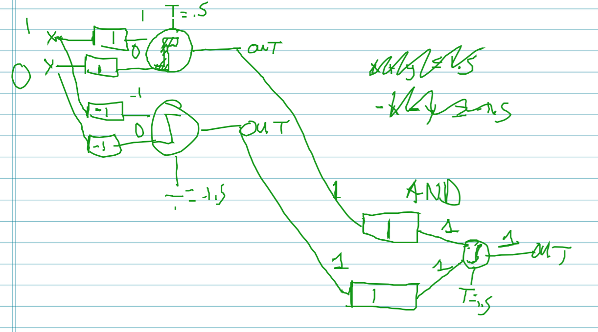
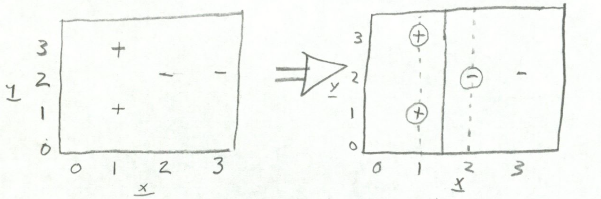
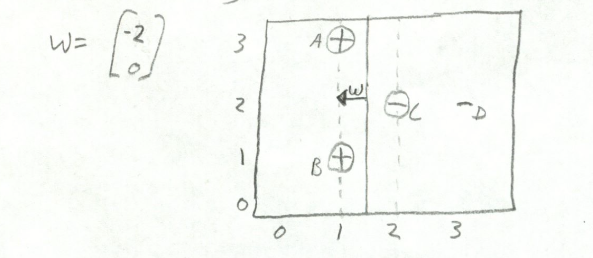

#6.034 Exam 3 Cheat Sheet

##Neural Nets

###Useful Information
1) Neural Nets are numerical classifiers with binary (`0/1`) output
2) The neuron is a primitive circuit element
3) Forward propagation computes the overall output of a neural net

(Input Layer) -> (Logic Function Layers) -> Output (`0/1`)

A single neuron can draw one line and shade above or below it

###Primitive Logic Functions

####Computable by a Single Neuron

Note: used in the __logic__ layer

- `AND(x,y)`  

\

- `OR(x,y)`  

\

- `AND(x, NOT(y))`  

\

\* note, the circle on the line means that the weight is `-1`)

-  `NOT(x)`

\

- "`MAJORITY(x1, x2, x3, x4, ...)`" (3 input example)  

\
  - note, doubling the weight of the bottom input (`x3` for instance) makes this gate act like `OR(AND(x1, x2), x3)`

####Need More than One Neuron

- `XOR(x, y)`(3 neurons to compute)

The $T$ at the end is $+1.5$

###Helper Functions

$$
\text{Stairstep}_T(x) =
\begin{cases}
  1 & \mbox{if } x \geq T \\
  0 & \mbox{if } x < T
\end{cases}
$$

$$
\text{Sigmoid}_{S, M}(x) =
\frac{1}{1 + e^{-S(x -m)}}
$$

$$
\text{Performance} = \text{Accuracy}(out*, out) = \frac{1}{2}(out* - out)^2
$$

  - \* means __desired__ output

###Quick Formulas For Backward Propagation

$$
W_{A \rightarrow B}' = W_{A \rightarrow B} + \Delta W_{A \rightarrow B}
$$
$$
\Delta W_{A \rightarrow B} = r \cdot out_A \cdot \delta_B
$$

$$
\delta_B =
\begin{cases}
out_B(1- out_B)(out* - out) & \mbox{if neuron B is in final (output) layer} \\
out_B(1 - out_B)\sum_{outgoing C_i} W_{B \rightarrow C_i}\delta_{C_i} & \mbox{if neuron B is not in final (output) layer}
\end{cases}
$$

###Backwards Propagation Steps

1. Computing output of each neuron using forward Propagation and _Stairstep_~_T_~ function

2. Compute $\delta_B$ for final layer

3. Compute $\delta_B$ for earlier layers

4. Compute updates for weights

5. Update all weights

###Miscellaneous Notes

- You can never classify all points correctly if you have a `+` data point and a `-` data point (contradictory) right on top of each other

__Overfitting__ - too strict with regards to the data it's trying to model

__Underfitting__ - too simple with regards to the data it's trying to model

##Support Vector Machines

###Useful Information
- like Neural Nets, classifies numerical data into two classes: `+` and `-`
- draws the decision boundary line that separates the training data with the widest possible margin

###Boundaries
- 1-D - just a point
- 2-D - some sort of line or curve
- 3-D - some sort of plane

###How to Draw SVM Boundaries (2D)
1. Draw the _convex hulls_ for the `+` and `-` training points.  
  - a convex hull is the shape you get when you wrap a rubber band around the points and let it contract  

\

2. Look at the regions where the convex hulls are closest.  
__3 Cases__:

\

3. The corresponding boundaries look like this:

\

###How to find the equation of the boundary line

1. Find the boundary line:

\

2. Write equation the for the line:

In the above example:
$$
x = 1.5
$$

3. Re-write the line equation to the form:
 $\vec{w} \cdot \vec{x} + b \Rightarrow \vec{w} \cdot \begin{pmatrix}x\\y\end{pmatrix} + b = 0$

In the above example:
$$
x = 1.5 \Rightarrow 0y + 1x - 1.5 = 0\Rightarrow  \underbrace{\begin{pmatrix}  1 & 0\end{pmatrix}}_{\vec{w}} \cdot \underbrace{\begin{pmatrix}x\\y\end{pmatrix}}_{\vec{x}} + \underbrace{(- 1.5)}_{b} = 0
$$

4. So, our decision boundary needs to follow a few conventions:

  - `positiveness(x)` = output of $\vec{w} \cdot \vec{x} + b$

  - `positiveness` for `+` support vectors: $+1$

  - `positiveness` for `-` support vectors: $-1$

  - `positiveness` for `+` training points: $\geq 1$

  - `positiveness` for `-` training points: $\leq -1$

So we need to scale $\vec{w} \cdot \vec{x} + b$ so that it actually follows these conventions.

We can do this by taking one of the support vectors and scaling the equation so that `positiveness` outputs the correct thing ($+1$ or $-1$ appropriately).

Using the `-` support vector $(2,2)$:

$$
\begin{pmatrix}  1 & 0\end{pmatrix} \cdot \begin{pmatrix}2\\2\end{pmatrix}+ (- 1.5) \Rightarrow 2 -1.5 = .5
$$

`postiveness(2,2)` should be $-1$, so we need to multiply the whole equation by $-2$.

$$
\underbrace{\begin{pmatrix}  -2 & 0\end{pmatrix}}_{\vec{w}} \cdot \underbrace{\begin{pmatrix}x\\y\end{pmatrix}}_{\vec{x}} + \underbrace{( 3)}_{b} = 0
$$

Note that $\vec{w}$ should be $\bot$ to the decision boundary, and also pointing towards the positive points.

\

###How to find the $\alpha$ values for the training points

The $\alpha$ of a training point refers to how important it is when determining the boundary line.  

 - $\alpha = 0$ for non-support vectors
 - $\sum_{\vec{p} \in \text{"+" points}} \alpha_p$ = $\sum_{\vec{p} \in \text{"-" points}} \alpha_p$
 - solve $\vec{w} = \sum_{\vec{p} \in \text{"+" points}} \alpha_p\vec{p} - \sum_{\vec{p} \in \text{"-" points}} \alpha_p\vec{p}$

 In this case (from the above example):

 - $\alpha_d =0$, since it isn't a support vector

 - $\underbrace{\alpha_a + \alpha_b}_{ \text{"+" points}} = \underbrace{\alpha_c}_{ \text{"-"points}}$

 - $\underbrace{\begin{pmatrix}  -2 \\ 0\end{pmatrix}}_{\vec{w}} = \alpha_a\begin{pmatrix}  1 \\ 3\end{pmatrix} + \alpha_b\begin{pmatrix}  1 \\ 1\end{pmatrix} - \alpha_c\begin{pmatrix}  2 \\ 2\end{pmatrix}$

 - solving these gives you $\alpha_c =2$ and $\alpha_a=\alpha_b=1$

Note - the larger the margin width ($\frac{2}{||\vec{w}||}$), the smaller the $\alpha$ values
###Kernels

Sometimes our training data isn't linearly separable. So, try transforming the data (e.g, polar coords).

__Kernel Trick__ - replace the "$\cdot$" in  $\vec{w} \cdot \vec{x} + b$ with another function.
  - this function is called a __Kernel function__
  - this effectively transforms the space

A __Kernel function__ is a similarity measure.

\begin{align}
\text{class}(\vec{x}) & = \text{SIGN}[\vec{w} \cdot \vec{x} + b] \\
 & = \text{SIGN}[(\sum_{i}y_i\alpha_ix_i)\cdot \vec{x} + b] \\
 & = \text{SIGN}[(\sum_{i}y_i\alpha_i K(\vec{x_i},\vec{x}) + b]
\end{align}

So basically we're taking this test point $\vec{x}$ and comparing it with all of our support vectors, and then taking a weighted sum of that.

####Common Kernel Functions

1. Linear Kernel (e.g.) dot product

$$
K(\vec{u}, \vec{v}) = \vec{u} \cdot \vec{v}
$$

2. Quadratic Kernel Function

Draws conic sections:
  - circle
  - ellipse
  - hyperbola
  - parabola
  - normal line

Ex:

$$
K(\vec{u}, \vec{v}) = (\vec{u} \cdot \vec{v} + 1)^2
$$

3. Radial (Gaussian) Basis Kernel Function  

Basically draws circles around each points. Has a parameter to adjust "how tight" the circles and grouping is.

__Can perfectly classify any set of training data, as long as you don't have contradictory test data.__

- can sometimes overfit

$$
e^{\frac{|\vec{u} - \vec{v}|^2}{\sigma}}
$$
