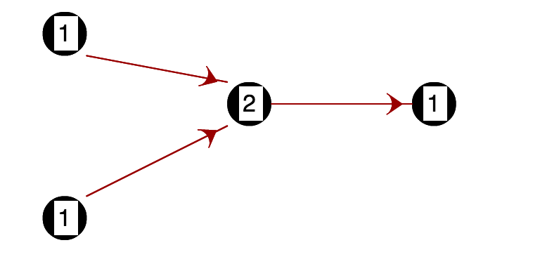
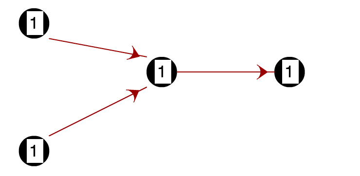
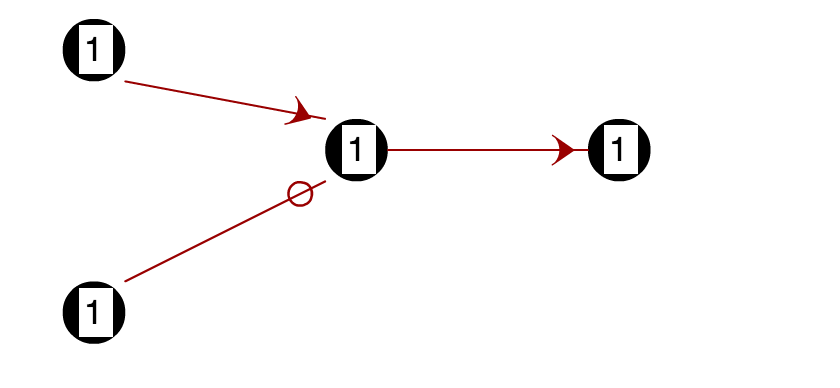
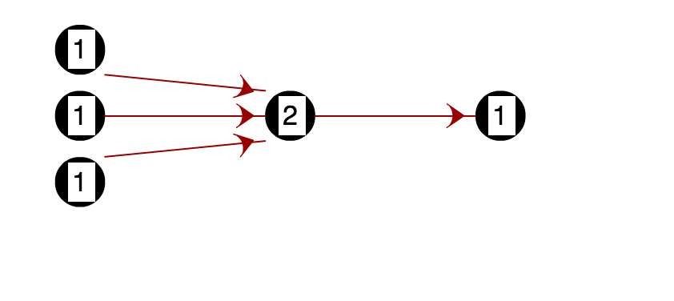
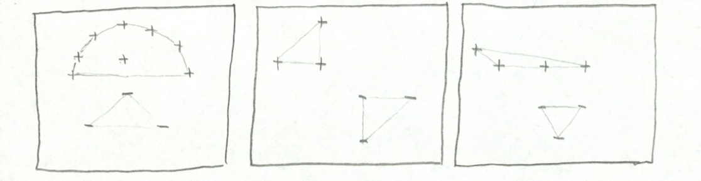
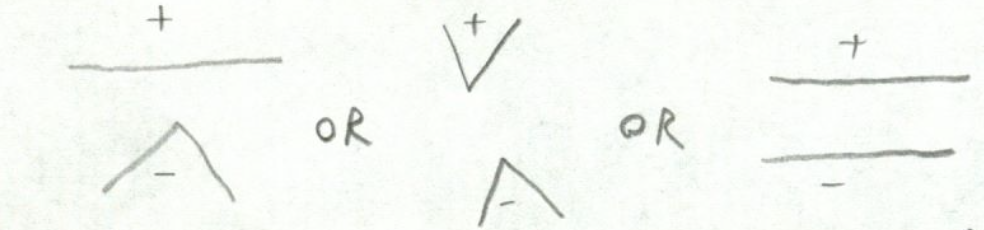
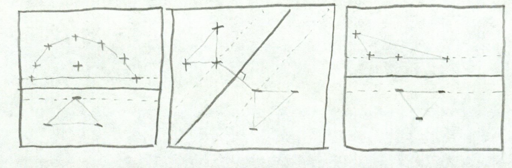

#6.034 Exam 3 Cheat Sheet

##Neural Nets

###Useful Information
1) Neural Nets are numerical classifiers with binary (`0/1`) output
2) The neuron is a primitive circuit element
3) Forward propagation computes the overall output of a neural net

(Input Layer) -> (Logic Function Layers) -> Output (`0/1`)

A single neuron can draw one line and shade above or below it

###Primitive Logic Functions Computable by a Single Neuron

Note: used in the __logic__ layer

- `AND(x,y)`  

\

- `OR(x,y)`  

\

- `NOT(x, _)`  

\

\* note, the circle on the line means that the weight is `-1`)  

- "`MAJORITY(x1, x2, x3, x4, ...)`" (3 input example)  

\
  - note, doubling the weight of the bottom input (`x3` for instance) makes this gate act like `OR(AND(x1, x2), x3)`

###Helper Functions

_Stairstep__T__(x)_ =
$$
\begin{cases}
  1 & \mbox{if } x \geq T \\
  0 & \mbox{if } x < T
\end{cases}
$$

_Sigmoid__S, M__(x)_ =

$$
\frac{1}{1 + e^{-S(x -m)}}
$$

_Performance = Accuracy($out*, out$) =_ $\frac{1}{2}(out* - out)^2$

  - \* means __desired__ output

###Quick Formulas For Backward Propagation

$$
W_{A \rightarrow B}' = W_{A \rightarrow B} + \Delta W_{A \rightarrow B}
$$
$$
\Delta W_{A \rightarrow B} = r \cdot out_A \cdot \delta_B
$$

$$
\delta_B =
\begin{cases}
out_B(1- out_B)(out* - out) & \mbox{if neuron B is in final (output) layer} \\
out_B(1 - out_B)\sum_{outgoing C_i} W_{B \rightarrow C_i}\delta_{C_i} & \mbox{if neuron B is not in final (output) layer}
\end{cases}
$$

###Backwards Propagation Steps

1. Computing output of each neuron using forward Propagation and _Stairstep_~_T_~ function

2. Compute $\delta_B$ for final layer

3. Compute $\delta_B$ for earlier layers

4. Compute updates for weights

5. Update all weights

###Miscellaneous Notes

- You can never classify all points correctly if you have a `+` data point and a `-` data point (contraditory) right on top of each other

__Overfitting__ - too strict with regards to the data it's trying to model

__Underfitting__ - too simple with regards to the data it's trying to model

##Support Vector Machines

###Useful Information
- like Neural Nets, classifies numerical data into two classes: `+` and `-`
- draws the decision boundary line that separates the training data with the widest possible margin

###Boundaries
- 1-D - just a point
- 2-D - some sort of line or curve
- 3-D - some sort of plane

###How to Draw SVM Boundaries (2D)
1. Draw the _convex hulls_ for the `+` and `-` training points.  
  - a convex hull is the shape you get when you wrap a rubber band around the points and let it contract  

\

2. Look at the regions where the convex hulls are closest.  
__3 Cases__:

\

3. The corresponding boundaries look like this:\
  
